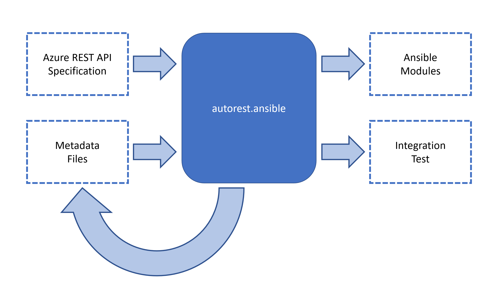
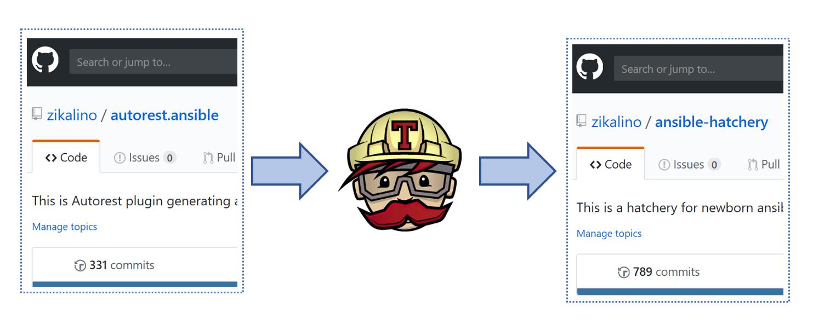

# How it works?



**autorest.ansible** is fully capable of generating fully functioning Ansible modules from Azure REST API without any additional input.
These autogenerated modules are however too complex and not always match Ansible guidelines.

Therefore **autorest-ansible** can accept additional input metadata that allows finetuning of autogenerated modules.

Various transformations can be done using metadata file, some examples include:
- renaming modules
- renaming / hiding / flattening options
- renaming / hiding / flattening return values
- adjusting documentation
- adjusting samples

**autorest-ansible** can generate following:
- main modules
- facts modules
- integration tests
- samples


# Infrastructure

- all the changes should be made to **zikalino/autorest.ansible** repository
- changes are intercepted by **Travis**, and the build and:
  - autorest extension is automatically rebuilt
  - autorest.ansible docker container is rebuilt
  - modules are generated for all requested APIs
- All changes are automatically pushed to **authogenerated** branch in **zikalino/ansible-hatchery**




# How to use Autorest.Ansible?

Recommended way to use this extension is to use Docker image that is automatically produced by the CI.

CI is here: https://travis-ci.org/zikalino/autorest.ansible

Modules (shall be) generated here: https://github.com/zikalino/ansible-hatchery
Note: additional step needs to be added in the CI to create PR automatically

  docker run -v <your-output-directory>:/ansible-hatchery -v <your-temporary-directory>:/ansible-hatchery-tmp dockiot/autorest-ansible-alt <api-to-generate>

where:

**your-output-directory** - is the directory where modules will be generated

**your-temporary-directory** - this directory is used by the generator as a temporary directory, and some additional diagnostic output will be written here

**api-to-generate** - what should be generated? Use **all** to generate all configured modules, or **sql**, **mysql**, **keyvault**, etc. Check **scripts** subdirectory for available scripts.

# How to add additional API groups?

You have to add additional **generate-api-group-name.sh** script in **scripts** subfolder:

``` bash
cd /azure-rest-api-specs/specification/api-group-name/resource-manager
autorest --output-folder=/ansible-hatchery-tmp/ --use=/autorest.ansible --python --tag=package-2017-04-preview
```

and include it in **generate-all.sh** as follows:

``` bash
...
/autorest.ansible/scripts/generate-api-group-name.sh
```

## Metadata Template

After adding scripts to generate new API group, generator will run automatically, and you can find your new metadata template in:

https://github.com/zikalino/ansible-hatchery/tree/master/__template

Copy **azure_rm_apigroupname.metadata.template.yml** to https://github.com/zikalino/autorest.ansible/tree/master/tweaks, where you can start modifying it.

# How to tweak generator output?

Following tweaks can be applied to the generator output:

## Changing Module Name

Automatically generated modules have pre-assigned names, but they can be renamed by applying appropriate tweak:

Find module name in the metadata file and apply rename tweak as follows:

``` yaml
- azure_rm_sqlrestorepoint_facts:
    - rename: azure_rm_xxxxxxxxxxx_facts
```

## Rename Option

Renaming options is very simple. Just find appropriate option in metadata file, and add tweak as follows:

``` yaml
- azure_rm_sqlrestorepoint_facts.resource_group_name:
    - rename: resource_group
```

## Flatten Options

## Hide Unnecessary Options

## Change Default Option Values

## Update Sample Option Values

## Update Test Dependencies

## Update Test Field Values

## Rename Return Value

``` yaml
- azure_rm_mysqlserver_facts.response.sku.name:
    - rename: new_name
```

## Collapse Return value

``` yaml
- azure_rm_mysqlserver_facts.response.sku:
    - collapse
```

Some future plans:
- flexible REST API -> input parameter mapping
- flexible REST API -> facts return values mapping
- idempotency comparison definitions

More information will be added here...


# AutoRest extension configuration

``` yaml
use-extension:
  "@microsoft.azure/autorest.modeler": "2.1.22"

pipeline:
  python/modeler:
    input: swagger-document/identity
    output-artifact: code-model-v1
    scope: python
  python/commonmarker:
    input: modeler
    output-artifact: code-model-v1
  python/cm/transform:
    input: commonmarker
    output-artifact: code-model-v1
  python/cm/emitter:
    input: transform
    scope: scope-cm/emitter
  python/generate:
    plugin: python
    input: cm/transform
    output-artifact: source-file-python
  python/transform:
    input: generate
    output-artifact: source-file-python
    scope: scope-transform-string
  python/emitter:
    input: transform
    scope: scope-python/emitter

scope-python/emitter:
  input-artifact: source-file-python
  output-uri-expr: $key

output-artifact:
- source-file-python
```
